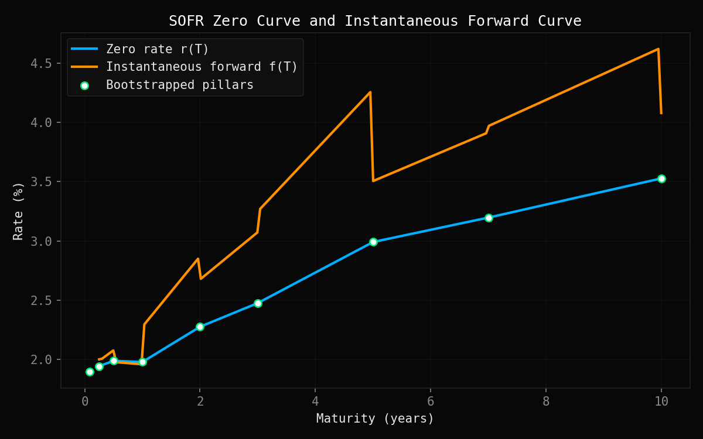
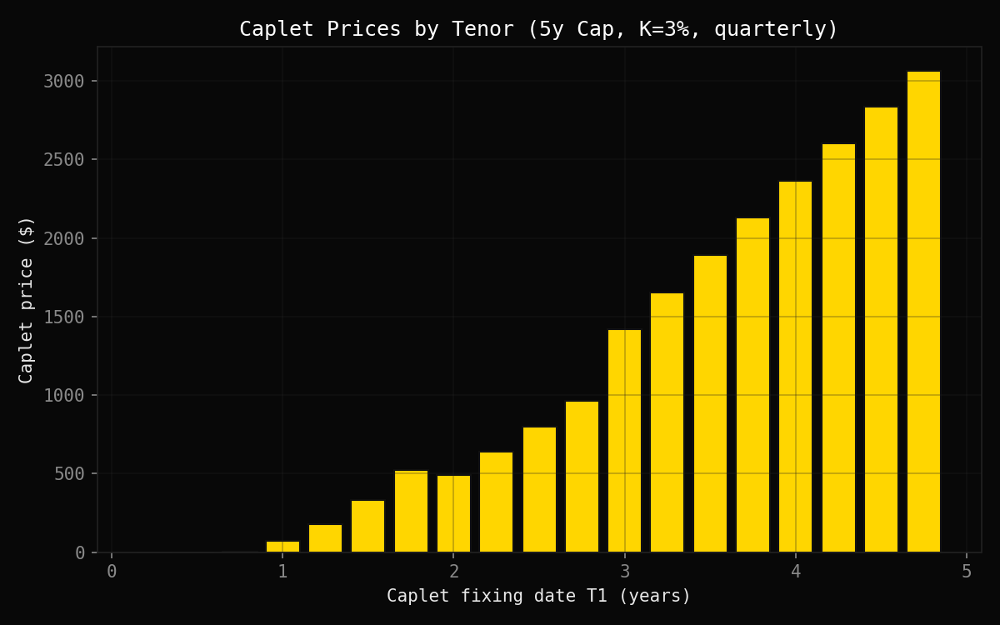
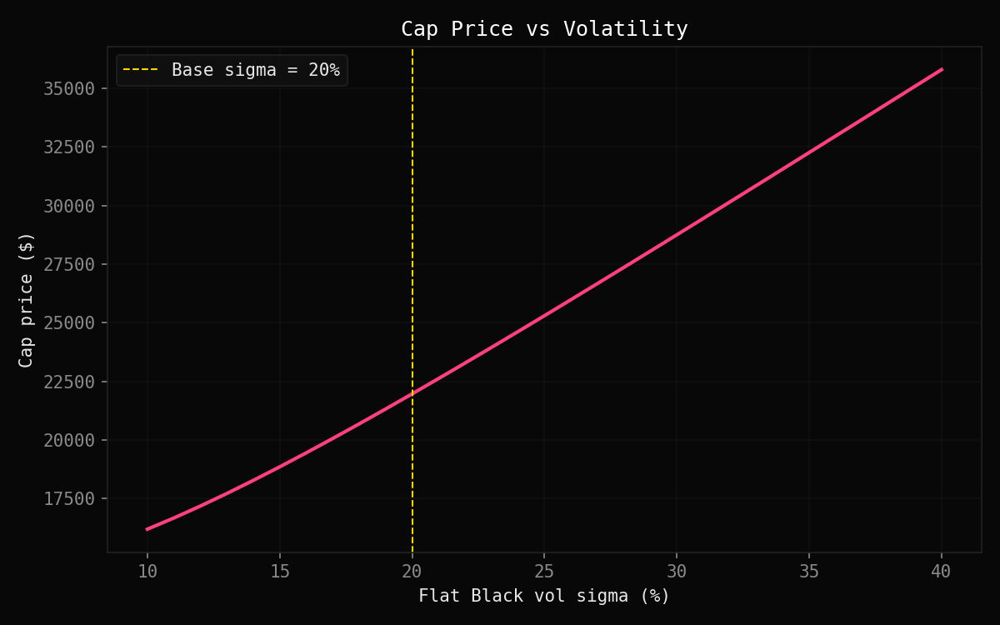

# SOFR Swap Curve Calibration & Cap Pricing


A self-contained Python project that bootstraps a SOFR-style zero-coupon
curve from market swap rates, then prices a vanilla interest rate cap on
that curve using Black-76, and computes its rate and vol sensitivities.

No QuantLib — pure `numpy` / `scipy` (only for `norm.cdf` in Black-76) /
`matplotlib`.

---

## Background

### Why bootstrap instead of reading rates directly

The market does not quote zero-coupon rates directly — it quotes **par
swap rates**, each of which is a weighted average over several discount
factors, not a clean rate at a single maturity. **Bootstrapping** solves
this inverse problem sequentially: each new tenor's discount factor is
isolated using discount factors already solved for at shorter tenors.

Money-market tenors (1m, 3m, 6m) have a single cash flow, so their par
condition is a direct one-line solve:

$$DF(T) = \frac{1}{1 + \text{rate} \cdot \tau}$$

Swap tenors (1y and beyond) pay an annual fixed coupon, so the par
condition involves a sum over all prior discount factors:

$$\text{swap\_rate} \cdot \sum_i \tau_i \, DF(t_i) + DF(t_n) = 1$$

Solving for the new (last) discount factor:

$$DF(t_n) = \frac{1 - \text{swap\_rate} \cdot \sum_{i<n} \tau_i \, DF(t_i)}{1 + \text{swap\_rate} \cdot \tau_n}$$

Zero rates (continuous compounding) follow directly:

$$r(T) = -\frac{\ln DF(T)}{T}$$

### Interpolation: linear, chosen over cubic spline

Pillars are interpolated **linearly** (`np.interp`). An earlier version of
this project used a cubic spline for smoothness, but that was reverted
after finding two concrete artifacts it produced on this exact dataset
(see [Known limitations](#known-limitations) for the full story):

- a small artificial **dip** in the zero curve between the 6m and 1y
  pillars (whose continuously-compounded rates are very close, since both
  derive from the same simple input rate converted with a different
  day-count fraction) — a value the data itself never implied;
- a sharp, economically implausible **overshoot** in the forward curve
  between the widely-spaced 7y and 10y pillars.

Linear interpolation cannot produce either artifact: a straight line
between two points is always monotonic between them, so it never
invents a value outside the range the pillars themselves imply. The
trade-off is a piecewise-linear zero curve (small kinks at each pillar)
and a forward curve that is a step function (jumps at each pillar,
constant in between) rather than smooth — see
[Known limitations](#known-limitations) for why this trade-off was
judged worth it here.

The **instantaneous forward rate** is derived from the curve's local slope:

$$f(T) = r(T) + T \cdot r'(T)$$

and the **simple forward rate** between two dates, the one actually used
for cap pricing:

$$F(T_1, T_2) = \frac{1}{\tau}\left[\frac{DF(T_1)}{DF(T_2)} - 1\right], \qquad \tau = T_2 - T_1 \text{ (Act/360)}$$

### Interest rate caps and Black-76

An interest rate **cap** protects a floating-rate borrower against rising
rates: at each reset date, the holder receives

$$\text{notional} \cdot \tau \cdot \max(F - K, 0)$$

A cap is a strip of independent **caplets**, one per accrual period — the
cap price is simply the sum of caplet prices.

Because a forward rate is not a tradeable asset (unlike a stock price),
caplets are priced with **Black's model (Black-76, 1976)** rather than
Black-Scholes: the forward rate itself is assumed lognormal under the
$T_2$-forward measure.

$$\text{Caplet} = \tau \cdot DF(T_2) \cdot \left[F \cdot N(d_1) - K \cdot N(d_2)\right]$$

$$d_1 = \frac{\ln(F/K) + \frac{1}{2}\sigma^2 T_1}{\sigma\sqrt{T_1}}, \qquad d_2 = d_1 - \sigma\sqrt{T_1}$$

The first period is excluded from pricing — its rate is already fixed at
trade inception, so it carries no optionality.

### Sensitivities: DV01 and Vega

Both are computed by **bump-and-reprice** (finite difference):

| Sensitivity | What is bumped | Requires re-bootstrap? |
|---|---|---|
| **DV01** | every input swap rate, +1bp parallel shift | **Yes** — rates are bootstrap inputs |
| **Vega** | flat Black vol σ, +1% absolute | **No** — σ only enters the pricing step |

DV01 is the rates-desk analogue of Delta: it measures sensitivity to a
market input, but one step removed from a directly tradeable underlying,
since the "underlying" here is the entire bootstrapped curve, not a
single observable price.

---

## Key results

Computed with the swap rates and cap specs in [Parameters](#parameters):

| Metric | Value |
|---|---|
| Zero rate (5y) | **2.99%** |
| Forward rate (4y → 4.25y) | **3.85%** |
| Cap price ($1M notional, K=3%, σ=20%) | **$21,963** |
| DV01 (+1bp parallel shift) | **$205** |
| Vega (+1% vol) | **$654** |

*(Run `python main.py` to reproduce — values are deterministic, no
Monte Carlo involved.)*

---

## Features

**Curve construction**
- Bootstrapping from money-market rates (1m, 3m, 6m) and par swap rates (1y–10y)
- Linear interpolation (chosen over cubic spline after finding concrete
  overshoot/dip artifacts on this dataset — see Known limitations)
- Discount factor, zero rate, simple forward rate, instantaneous forward rate queries

**Cap pricing**
- Black-76 caplet pricing
- Full caplet breakdown (tenor, forward rate, price)
- Intrinsic-value fallback for already-fixed periods

**Sensitivities**
- DV01 via full re-bootstrap bump-and-reprice
- Vega via same-curve repricing

**Validation**
- Flat-rate edge case (degenerate curve sanity check) — now passes to
  within floating-point precision (~1e-16) after switching to linear
  interpolation, down from ~2bp with the earlier cubic spline
- Fit-accuracy check (curve reprices its own calibration inputs to ~0 NPV)
- Known numerical limitations measured and documented, not hidden

**Visualisation**
- Zero curve & instantaneous forward curve vs maturity
- Caplet prices by tenor (bar chart)
- Cap price vs flat vol σ (10%–40%)

---

## Project structure

```
sofr_swap_cap/
├── curve.py            # bootstrap_zero_curve(), ZeroCurve class
├── cap_pricing.py      # black_caplet_price(), cap_price()
├── sensitivities.py    # compute_dv01(), compute_vega()
├── test_curve.py       # flat-rate edge case + fit-accuracy checks
├── style.py            # "Quant Dark" matplotlib theme
├── main.py             # orchestration, printed summary, plots
└── README.md
```

Every theory point (bootstrapping, interpolation choice, Black-76,
day-count conventions, DV01/Vega) is documented as a `# TODO: THEORY`
comment block directly above the relevant code in `curve.py`,
`cap_pricing.py`, and `sensitivities.py`.

---

## Quickstart

```bash
# 1. Install dependencies
pip install numpy scipy matplotlib

# 2. Run the full pricing pipeline
python main.py

# 3. Validate the curve itself
python test_curve.py
```

Runs in well under 3 seconds. `main.py` prints:

```
Zero rate 5y: 2.99%
Forward rate 4y->4.25y: 3.85%
Cap price: $21,963
DV01: $205
Vega (per 1% vol): $654
```

and opens three plots:
1. Zero curve & instantaneous forward curve vs maturity.
2. Caplet prices by tenor (bar chart).
3. Cap price vs flat vol σ (10%–40%).

`test_curve.py` prints a pass/fail table for both validation checks, with
documented tolerances (see [Known limitations](#known-limitations)).

---

## Parameters

**Curve inputs** (`SWAP_RATES` in `curve.py`):

| Tenor | Rate | Tenor | Rate |
|---|---|---|---|
| 1m | 1.90% | 3y | 2.50% |
| 3m | 1.95% | 5y | 3.00% |
| 6m | 2.00% | 7y | 3.20% |
| 1y | 2.00% | 10y | 3.50% |
| 2y | 2.30% | | |

**Cap specs** (`main.py`):

| Parameter | Value |
|---|---|
| Maturity | 5y |
| Strike (K) | 3% |
| Notional | $1,000,000 |
| Reset frequency | Quarterly |
| Day count | Act/360 |
| Flat vol (σ) | 20% |

---

## Known limitations

Intentional, documented simplifications worth being able to explain
rather than hide.

**Why linear interpolation, not cubic spline.** An earlier version used
a cubic spline for smoothness, but it produced two concrete artifacts on
this dataset: (1) a small artificial **dip** in the zero curve between
the 6m and 1y pillars, whose rates are nearly identical (~1.99% vs
~1.98%) — the spline invented a value neither pillar implied; (2) an
**overshoot** in the forward curve between the widely-spaced 7y and 10y
pillars, spiking to an implausible ~7%+. Linear interpolation (`np.interp`)
can't produce either: a straight line between two points is always
monotonic between them. `test_curve.py` confirms the fix — the flat-rate
edge case error dropped from ~2bp (cubic spline) to ~1e-16 (linear).

**The remaining trade-off**: the zero curve is now piecewise-linear
(small kinks at each pillar) and the forward curve is a step function
(jumps at each pillar) rather than smooth. Every value is still one the
pillar data genuinely implies — "kinked but truthful" was judged
preferable to "smooth but occasionally wrong." A production curve
builder wanting both would use a monotone-preserving interpolant (e.g.
monotone cubic Hermite).

**Gap-filling is still technically extrapolation.** Swap pillars aren't
all consecutive years apart (3y → 5y → 7y → 10y), so bootstrapping 5y
needs a discount factor at 4y, which was never quoted — filled by
interpolating only the *partial* pillar set known so far. This is why
the curve doesn't reprice its 5y/7y/10y inputs to *exactly* zero NPV in
`test_curve.py` (residuals of ~1e-4 to ~1e-3, tiny, documented with
widened tolerances). A fully rigorous fix would solve all unknown
discount factors simultaneously (a global/iterative bootstrap) instead
of building forward pillar-by-pillar.

---

## Gallery

| Zero curve & instantaneous forward | Caplet prices by tenor |
|:---:|:---:|
|  |  |

| Cap price vs volatility |
|:---:|
|  |

---
